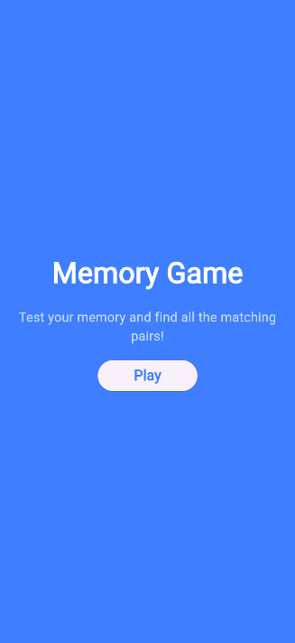
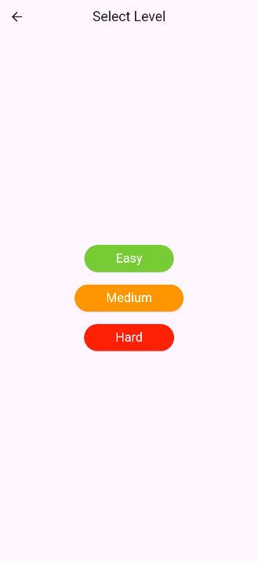
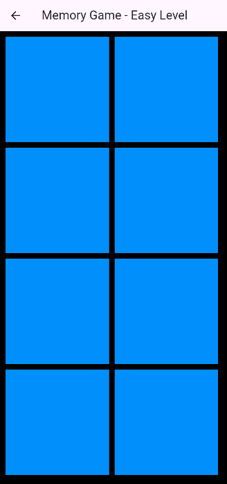
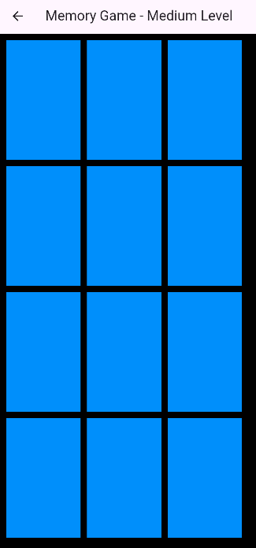
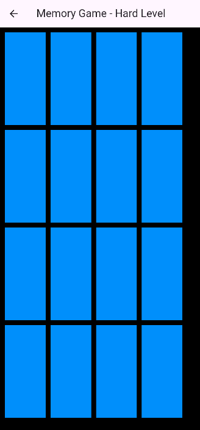
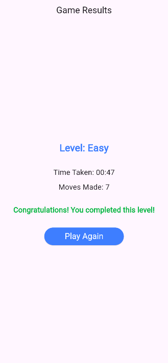
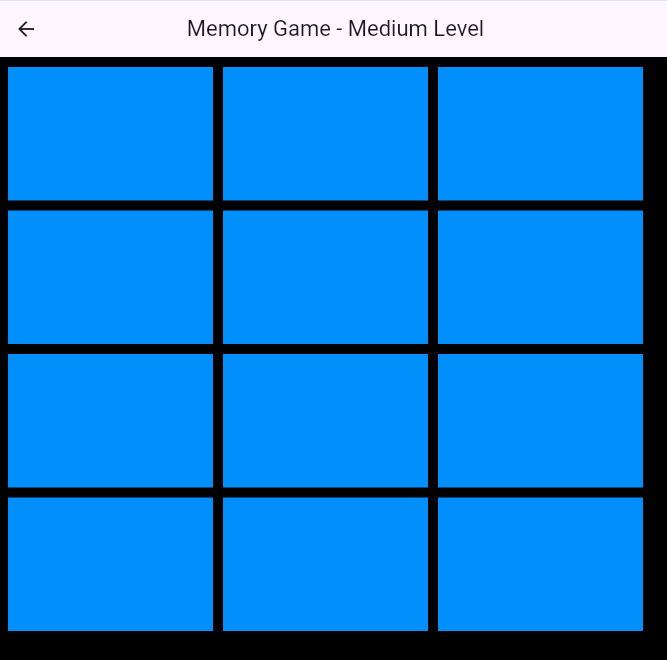
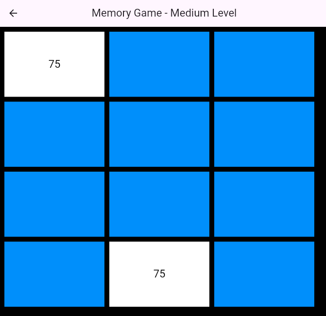
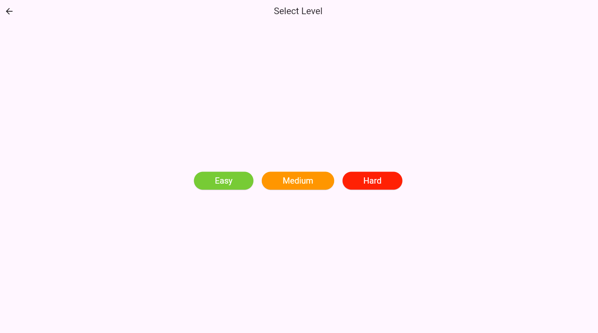
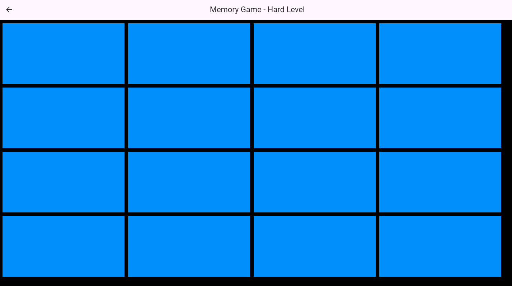

# Memory Game

## Overview

**Memory Game** is an engaging and interactive game designed to challenge and improve your memory skills. The goal is to find all the matching pairs of cards by flipping them. The game features three levels of difficulty, intuitive navigation, and a responsive design that adapts to various screen sizes. Progress is saved, so that players can continue where they left. This game has been developed as part of the [Device-Agnostic Design Course at Aalto University](https://fitech101.aalto.fi/courses/device-agnostic-design/).

## Purpose

The purpose of Memory Game is to provide a fun and challenging way for users to enhance their memory. With progress tracking and intuitive gameplay, the Memory Game aims to entertain and engage players.

The application is deployed and available to test here: [Memory Game App](https://yourdeploymenturl.com).

## Features

- **Start Screen**: Welcomes the user with the game title and a Play button to navigate to the level selection screen.
- **Level Selection Screen**: Allows players to choose between three levels of difficulty (Easy, Medium, Hard). Completed levels are marked as "completed."
- **Responsive Gameplay**: The card grid adjusts dynamically based on the screen size, ensuring an optimal experience on all devices.
- **Progress Tracking**: Tracks which levels have been completed and saves this progress between sessions.
- **Touchscreen Optimized**: The game is designed for touch input, making it perfect for mobile devices and tablets.
- **Game Screen**: Players flip cards to match pairs. The game includes a time limit for an added challenge.
- **Result Screen**: Displays the player's performance, including time taken and moves made, and allows replaying the game or selecting a different level.

## How to Play

1. **Getting Started**: Begin at the start screen and tap the Play button to proceed.
2. **Selecting a Level**: Choose between Easy, Medium, or Hard levels on the level selection screen. Previously completed levels are marked as "completed."
3. **Matching Pairs**:
   - Flip a card to reveal its number.
   - Match it with another card with the same number to keep them flipped.
   - Unmatched cards flip back automatically in one second.
4. **Complete the Level**: Match all pairs within the time limit of 2 minutes to complete the level.
5. **Review Results**: After completing a level, view your moves and time on the result screen.

## Navigation

- **Start Screen**: Navigate to the level selection screen.
- **Level Selection Screen**: Navigate to the game screen or review completed levels.
- **Game Screen**: Play the game and match pairs of cards.
- **Result Screen**: Navigate back to the level selection screen or replay the game.

## Screenshots

Below are some screenshots to give you a better understanding of the application interface:

- **Start Screen**

  

- **Level Selection Screen**

  

- **Easy Level Gameplay**

  

- **Medium Level Gameplay**

  

- **Hard Level Gameplay**

  

- **Result Screen**

  

- **Responsive Layout**

  
  

  
  